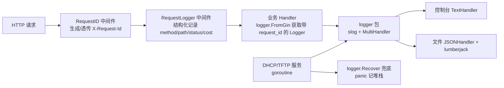

## 产品概述

用户要求梳理并标准化 pxe-go 后端代码的日志记录，使其符合最佳工程实践，核心目标是提升可观测性、避免代码 bug 无法被发现（错误被静默吞掉、goroutine panic 导致进程崩溃、业务日志与请求无法关联、敏感信息泄露等问题）。代码量较大，要求制定计划后分步骤完成，每步可编译可验证。

## 核心功能

- **日志基础设施重构**：保留现有 `logger.Info/Debug/Warn/Error` 调用签名（零改动业务调用点），内部基于 Go 标准库 `log/slog` 升级为结构化日志，支持字段上下文（With）、统一 Recover 助手、控制台文本 + 文件 JSON 双输出。
- **请求追踪**：HTTP 请求增加 request ID，贯穿中间件与业务 handler 日志，使访问日志与业务日志可关联。
- **消除静默吞错**：修复全库约 30 处 `_ = db.Xxx()` / `_, _ =` 忽略错误的代码，按"关键路径 Error + 中止、降级路径 Warn + 继续"分级记录。
- **崩溃兜底**：为 DHCP/TFTP 服务、配置热加载等 goroutine 添加 recover，panic 时记录完整堆栈而非进程崩溃。
- **安全与规范**：清理日志中的明文密码（如 KS 模板 root 密码），统一日志级别选择、字段命名与消息风格。

## 技术栈选择

- **日志库**：基于 Go 标准库 `log/slog`（项目 Go 1.25.0，内置可用）重构自研 `internal/logger` 包，**零新增第三方依赖**。
- **不引入 zap/logrus**：现有 60+ 处调用点全部使用 `logger.Info(format, args...)` 风格，基于 slog 重构可在保持 API 兼容的同时获得结构化能力，避免大规模改动与依赖膨胀。
- **文件轮转**：继续使用现有 lumberjack，输出端改为 JSON 格式（便于日志平台采集），控制台保持人类可读的 text 格式。

## 实现方法

保留 `logger.Debug/Info/Warn/Error` 与 `SetLevel` 的签名不变，内部将格式串经 `slog` 输出；新增 `logger.With`、`logger.Recover`、`logger.FromGin/FromContext` 等能力，通过自定义 MultiHandler 将同一日志同时分发到控制台 TextHandler 与文件 JSONHandler。中间件层新增 RequestID（透传/生成 `X-Request-Id`）并将 ID 放入 gin context，业务 handler 通过 `logger.FromGin(c)` 获取自动携带 request_id、path 的 Logger。逐文件修复静默吞错与 goroutine panic 兜底，最后统一规范审查。

### 系统架构



### 关键设计决策

- **API 兼容优先**：`logger.Info("...", args...)` 等 4 个顶层函数签名不变，仅 `Init` 增加 `error` 返回值（全库仅 `cmd/server/main.go` 一处调用）。
- **错误分级**：可恢复/尽力而为操作失败记 Warn 并继续；关键路径（DB 写入、服务启动、文件落盘）失败记 Error 并中止/返回错误。
- **字段规范**：结构化字段统一英文 snake_case（`request_id`、`client_ip`、`cost_ms`、`mac`、`ip`、`subnet` 等），消息文本保留中文便于人工阅读。
- **敏感信息**：所有日志禁止记录密码/明文 token，KS 模板创建日志仅记录名称与"是否设置密码"布尔值。

## 实现注意

- **兼容性**：顶层 4 个日志函数与 `SetLevel` 签名不变；`Init` 变更为返回 error 后同步修改 main.go 处理失败场景（stderr 提示并继续控制台模式）。
- **性能**：slog 在未达到级别时不格式化参数（懒求值），比当前 `fmt.Sprintf` 先格式化后判断级别的方式更优；热路径（DHCP 包交换、HTTP 请求）保持 Debug 级别，生产默认 Info 不产生额外开销。
- **避免误改**：修复静默错误时先确认语义——测试文件（`*_test.go`）中的 `_, _ =` 不改；`net.Conn.Close()`、`zip.Writer.Close()` 等资源关闭忽略属于常规惯例，仅在关键位置补充 Warn。
- **验证门禁**：每个任务完成后执行 `go build ./...`、`go vet ./...`、`go test ./...` 三项全绿方可进入下一步。

## 目录结构（修改清单）

```
cmd/server/main.go                        # [MODIFY] Init 返回值处理；reload goroutine 加 Recover
internal/logger/logger.go                 # [MODIFY] 基于 slog 重构：With/Recover/FromGin/FromContext/MultiHandler
internal/logger/logger_test.go            # [MODIFY] 更新测试覆盖结构化输出、级别过滤、Recover
internal/middleware/middleware.go         # [MODIFY] 新增 RequestID 中间件；RequestLogger 改结构化字段
internal/service/httpapi/server.go        # [MODIFY] 挂载 RequestID；占位符替换失败记录 Warn
internal/service/httpapi/handler_*.go     # [MODIFY] 约 12 个文件：静默错误修复 + FromGin 上下文 + 密码脱敏
internal/service/dhcp/dhcp.go             # [MODIFY] Serve goroutine Recover + Error；mask.Size 错误处理
internal/service/tftp/tftp.go             # [MODIFY] 确认 goroutine 兜底；Close 错误处理
internal/service/ksrender/ksrender.go     # [MODIFY] ListKSTemplates 错误记录
internal/db/db.go                         # [MODIFY] 清理类 Exec 失败记录 Warn
docs/LOGGING.md                           # [NEW] 日志规范文档（级别定义/字段命名/示例）
```

## 关键代码结构

```
// internal/logger 新增能力（核心跨模块接口）
type Logger struct{ sl *slog.Logger }

func With(kv ...any) *Logger                 // 全局带字段 Logger
func (l *Logger) With(kv ...any) *Logger     // 派生子 Logger
func (l *Logger) Info(format string, args ...any)
func (l *Logger) Error(format string, args ...any)
func Recover(name string)                    // defer logger.Recover("dhcp-serve") 记录 panic 堆栈
func FromGin(c *gin.Context) *Logger         // 自动附加 request_id/path/client_ip
func FromContext(ctx context.Context) *Logger
```

## Agent Extensions

### Skill

- **Code**
- 用途：贯穿全部实现步骤，按"规划→实现→验证"编码工作流推进，保证每步有明确验证门禁（go build/vet/test）。
- 预期结果：所有改动符合规范编码流程，每步提交前验证通过。

### SubAgent

- **code-explorer**
- 用途：在执行任务 3/4 前，用于核查各 handler 与服务层中静默忽略错误处的真实语义（关键路径还是降级路径），避免误改业务逻辑。
- 预期结果：输出每处 `_ = db.Xxx()` 的错误处理分级建议，保证修复精准不破坏现有行为。